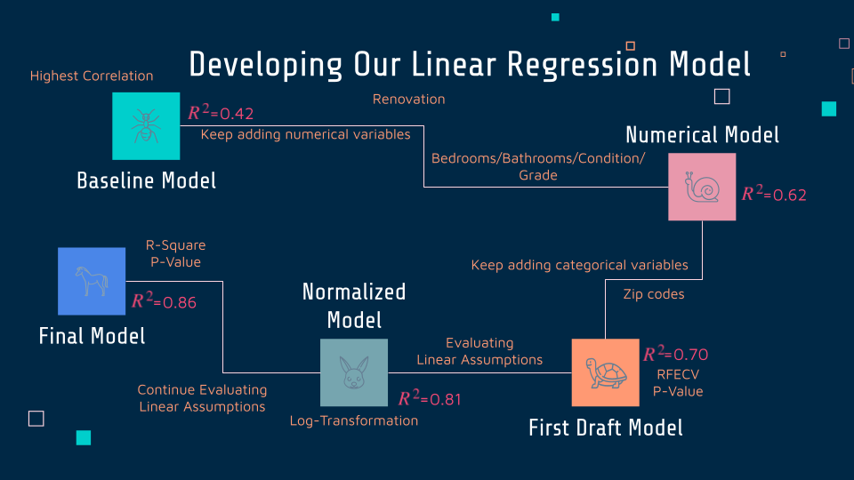
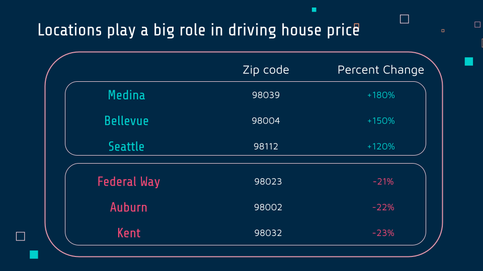
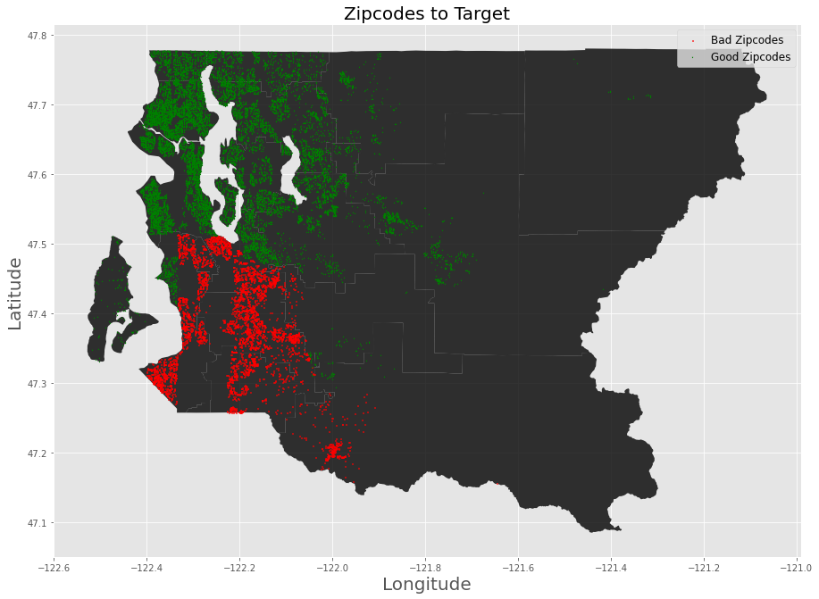
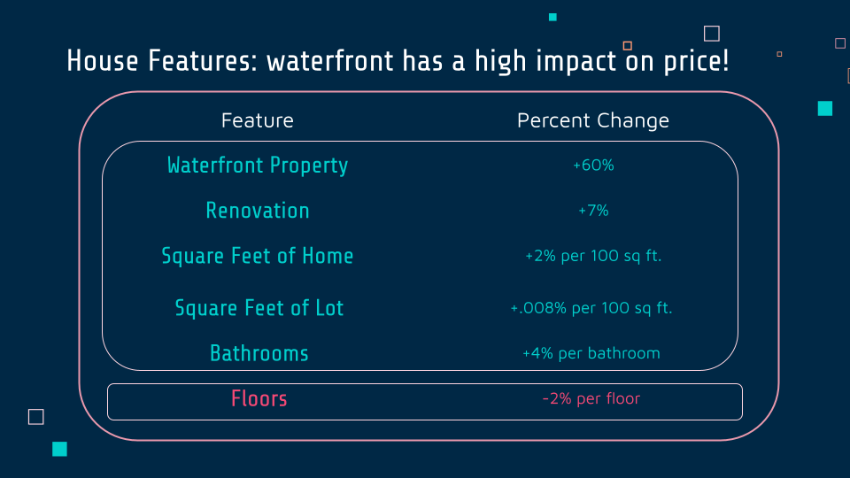

# Flipping Houses in King County

**Authors**: [George Ferre](mailto:george@flatironschool.com) and [Ramil Chaimongkolbutr](mailto:ramil@flatironschool.com)

## Overview

In this project, we develop a linear regression model in order to determine factors that drive the price of houses in King county. As a result, we can make suggestions regarding whether or not should our stakeholders invest in flipping houses in this area. 

## Business Problem

We build a pricing model to help our stakeholders understand the impact of renovation on houses in King County. The goal is to find out that renovation can actually increase the value of the house and is worthwhile for investment. 

We also identify specific areas that the house should be and features of the house our stakeholders should focus on. Our model should be able to tell us something about the relationship between these features of the house and its price.  

## Data

We have access to a dataset containing over 20000 sale records of houses in King County during 2014-2015, including selling price, house features and locations. The data combine with both numerical and categorical attributes of the houses. Even though some of our data are in numerical form, they have to be treated as categorical, for example, zip codes, renovation, and basement. Some of numerical attributes such as latitude and longitude are irrelevant to our model.    

## Methodology

We start off with exploring corelation between price and other variables. We build our baseline model using sqft. living, highest correlation and renovation, our key factor. The baseline model gets a score of 0.48. Next, we focus on adding numerical features such as grade, condition, bedrooms, and bathrooms. After that, we add categorical features such as waterfront, basement, and zip codes. The latest two mentioned are preprocessed as dummy variables using OneHotEncoder. We also utilize recursive feather elimination along the way before ending up with first draft model. We evaluate the model by testing for linear regression assumption. Finally, we choose to normalize the model and eliminate insignificant variables. As a result, our final model scores pretty well at 0.86.  



## Results

1. We have found that renovation has an impact on increasing a selling price by 7% of its geometric mean. 

2. Locations play a big role in driving house price in both directions:
- Having a house in Medina can increase the price by 180%.
- Having a house in Bellevue increases the price by 150%.
- Having a house in Seattle increases the price by 120%.
- Having a house in Federal Way, Auburn, and Kent, however, decrease the price by 21%, 22% and 23%, respectively.





3. House feature: waterfront has the highest impact on price!
- Waterfront property can increase the price by 60%.
- The price increases by 2% of every 100 increasing in square feet living.
- The price shows an increment as low as 0.008% per 100 increasing in square feet lot.
- Bathrooms increases the price by 4% per bathroom.
- Number of floors, however, decreases the price by 2%.



## Conclusions

We agree that renovation matters! I believe that a renovated house generally has high price than one that is not.

We recommend that the property should be bought in the right area. 

We have found that our house flippers should pay attention to a larger house rather than a larger lot.

Last but not least, we concur that waterfront property is gold! We suggest grabing it immediately!

## Next Steps

We can improve our model by adding some more complexity such as polynomial regression. We might be able to get more understanding and provide a better explanation to our stakeholders.
 
## For More Information
See full analysis in [Jupyter Notebook](./project2code.ipynb) or check out this [presentation](./presentation.pdf). 
For additional info, contact Ramil Chaimongkolbutr at [ramil.ming@flatironschool.com](mailto:ramil.ming@flatironschool.com) or George Ferre at [georgeaferre@flatironschool.com](mailto:georgeaferre@flatironschool.com)

## Repository Structure

```
├── data
├── images
├── README.md
├── project_two_presentation.pdf
└── project_two_code.ipynb
```
